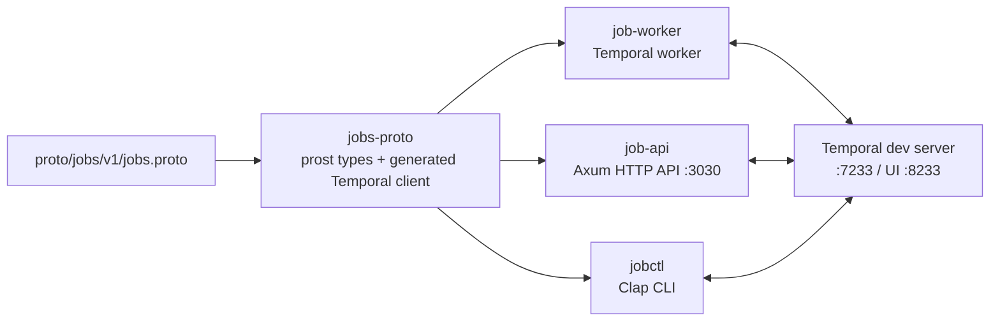
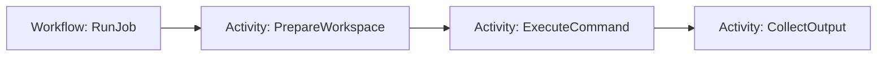

# job-queue example

`job-queue` is the end-to-end example for `protoc-gen-rust-temporal`.
One annotated proto service defines a Temporal workflow, signals, queries, and
activities. The generated Rust surface is shared by a worker, an HTTP API, and
a CLI client.



## Workflow

`RunJob` is a stubbed workflow with three activities.

- `PrepareWorkspace` simulates preparing a workspace for the job.
- `ExecuteCommand` simulates running the requested command and returns a canned `JobOutput`.
- `CollectOutput` simulates collecting final output before the workflow completes.



## protoc-gen-rust-temporal integration

[`proto/jobs/v1/jobs.proto`](proto/jobs/v1/jobs.proto) is the single source of
truth. Running `just gen` builds the local `protoc-gen-rust-temporal` plugin
and runs [`buf generate`](proto/buf.gen.yaml), which writes generated Rust into
[`crates/jobs-proto/src/gen/`](crates/jobs-proto/src/gen/).

`jobs-proto` commits the generated files so the example builds without running
codegen first:

- [`jobs/v1/jobs_temporal.rs`](crates/jobs-proto/src/gen/jobs/v1/jobs_temporal.rs)
  is generated by `protoc-gen-rust-temporal`. It contains the typed Temporal
  client, workflow handle, activity traits, message type metadata, and worker
  registration helpers.
- [`jobs/v1/jobs.v1.rs`](crates/jobs-proto/src/gen/jobs/v1/jobs.v1.rs),
  [`temporal/v1/temporal.v1.rs`](crates/jobs-proto/src/gen/temporal/v1/temporal.v1.rs),
  and
  [`temporal/api/enums/v1/temporal.api.enums.v1.rs`](crates/jobs-proto/src/gen/temporal/api/enums/v1/temporal.api.enums.v1.rs)
  are generated by `protoc-gen-prost`. They contain protobuf message and enum
  types.

The application crates all depend on `jobs-proto`:

- [`job-worker`](crates/job-worker/) registers `RunJob` and `JobActivities`
  through generated helper functions.
- [`job-api`](crates/job-api/) wraps the generated `JobServiceClient` behind
  HTTP routes.
- [`jobctl`](crates/jobctl/) uses the same generated client directly from the
  command line.

## Layout

- `proto/` - Buf module with the `jobs.v1` contract and vendored annotations.
- `crates/jobs-proto/` - generated protobuf types and Temporal client code.
- `crates/job-worker/` - workflow and activity implementation.
- `crates/job-api/` - HTTP API for submitting, cancelling, and reading jobs.
- `crates/jobctl/` - CLI client for the same workflow contract.

## Test

Fast checks do not require a running Temporal server:

```bash
just check
just test
just verify
```

After changing `proto/jobs/v1/jobs.proto`, regenerate before testing:

```bash
just gen
just verify
```

To run the live stack and E2E script, install the Temporal CLI and `cargo-watch`,
then run:

```bash
just dev
just demo
just down
```

`just demo` submits jobs through both `jobctl` and the HTTP API, verifies that
both consumers can observe the same workflow state, cancels one job, and waits
for another to complete.
